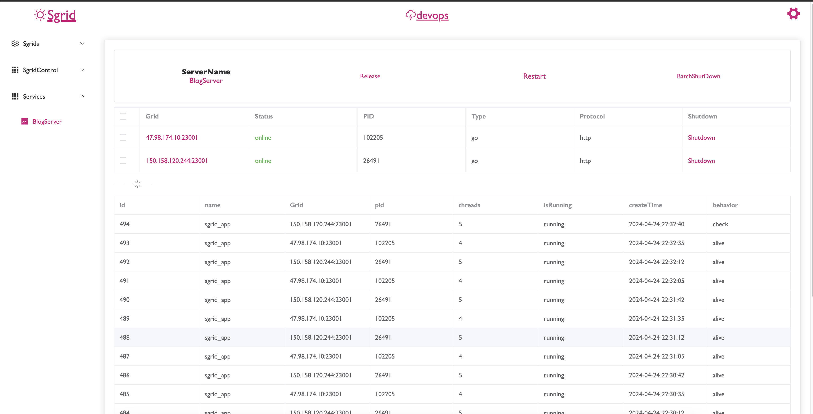
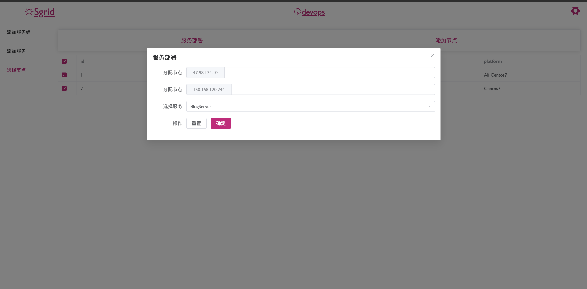
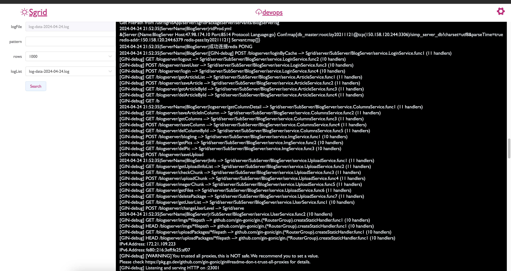

<h2 align="center" style="color:rgb(207, 15, 124)">SgridCloud</h2>

<h5 align="center" style="color:rgb(207, 15, 150)">
SgridCloud是为个人开发者或初创公司构建的，
它包括一整套开发到生产的流程
</h5>

[中文介绍](./readme_zn.md)

***
<h4 align="center">HomePage</h4>

<h4 align="center">Release</h4>

<h4 align="center">Logger</h4>

***

**Feature ::**

1. 控制中心
2. 发布文档记录
3. 发布版本控制
4. 动态扩容
5. 多节点管理
6. 服务组管理
7. 日志查询
8. 心跳检测

有了SgridCloud，您可以轻松开发，更快部署；